```{r setup, include=FALSE}
options(htmltools.dir.version = FALSE)
library(xaringanthemer)
style_mono_accent(
  base_color = "#1c5253",
  header_font_google = google_font("Josefin Sans"),
  text_font_google   = google_font("Montserrat", "300", "300i"),
  code_font_google   = google_font("Fira Mono")
)
```

# Hello!

.pull-left[

My name is **Monica Gerber**.

I graduated from Reed in 2011 with a degree in anthropology. I also studied a lot of Spanish, science, and even some math!

In 2015 I received a Master in Public Health (MPH) from Boston University. 

Now I am a biostatistician at Fred Hutch in the Statistical Center for HIV/AIDS Research and Prevention (S[CHARP](https://www.fredhutch.org/en/research/divisions/vaccine-infectious-disease-division/research/biostatistics-bioinformatics-and-epidemiology/statistical-center-for-hiv-aids-research-and-prevention.html)).

]

.pull-right[


]

---

# What can I help you with?

`r emo::ji("question")` What exactly is biostatistics?

`r emo::ji("books")` What are grad school options for studying biostatistics?

`r emo::ji("graduation_cap")` What do I do with a degree in biostatistics? 

`r emo::ji("sun")` How do I gain exposure to this field? How do I know this is for me?

`r emo::ji("woman_technologist")` What's your job like?


*And if I don't know, I can help you find out.*

---

# What is biostatistics?

Wikipedia says:

> The development and application of statistical methods to a wide range of topics in biology.

... and medicine and public health. 

It's the tools and techniques for collecting data, then summarizing, analyzing, and interpreting results. 

Biostatisticians *may* be more interested in the data and subject matter, and statisticians *may* be more interested in mathematical theory.

???

Usually the objective is to make an inference about a population by studying a subset of that population.

---

# An Example: HIV/AIDS pandemic

.pull-left[

* 38 million people living with HIV/AIDS worldwide
* 1.7 million new infections every year
* About 1.2 million people living with HIV/AIDS in the US


Source: hiv.gov, [Nature](https://www.nature.com/collections/qdtpvmnnqj)

]

.pull-right[

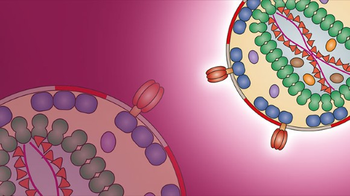

]

---

# Impact in the United States

```{r out.width="80%", echo=FALSE, fig.pos="center"}
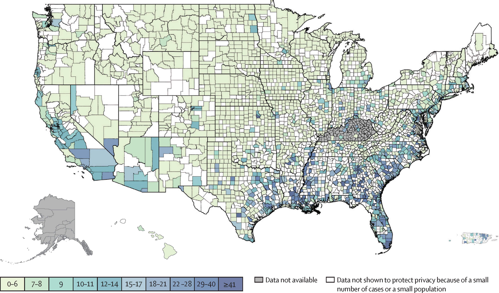
```

Diagnosed HIV prevalence by US county, 2018. Source: [The Lancet](https://www.thelancet.com/series/HIVinUSA).

---

# Impact in the United States

```{r out.width="62%", echo=FALSE, fig.pos="center"}
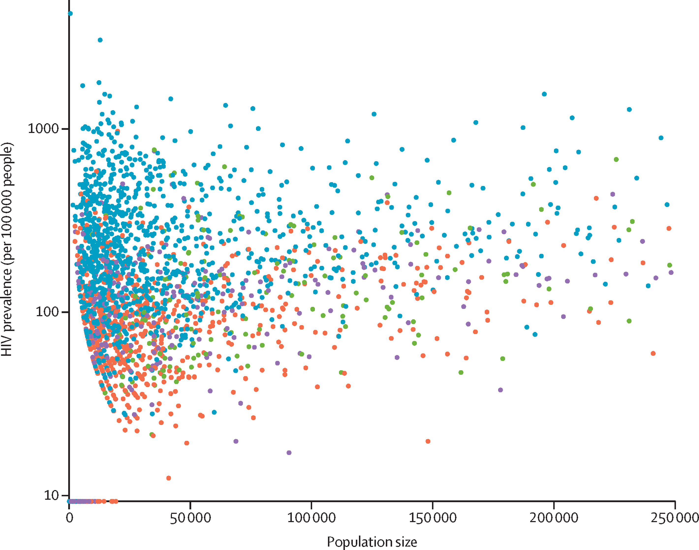
```

Scatterplot of HIV prevalence by US county population stratified by US Census region, 2018. For counties with populations of less than 50,000. Southern counties (blue dots) are more likely to have high HIV prevalence than the west (red), northeast (green), and midwest (purple). Source: [The Lancet](https://www.thelancet.com/series/HIVinUSA).

---

# Recent developments in treatment and prevention

.pull-left[

```{r out.width="90%", echo=FALSE, fig.pos="center"}
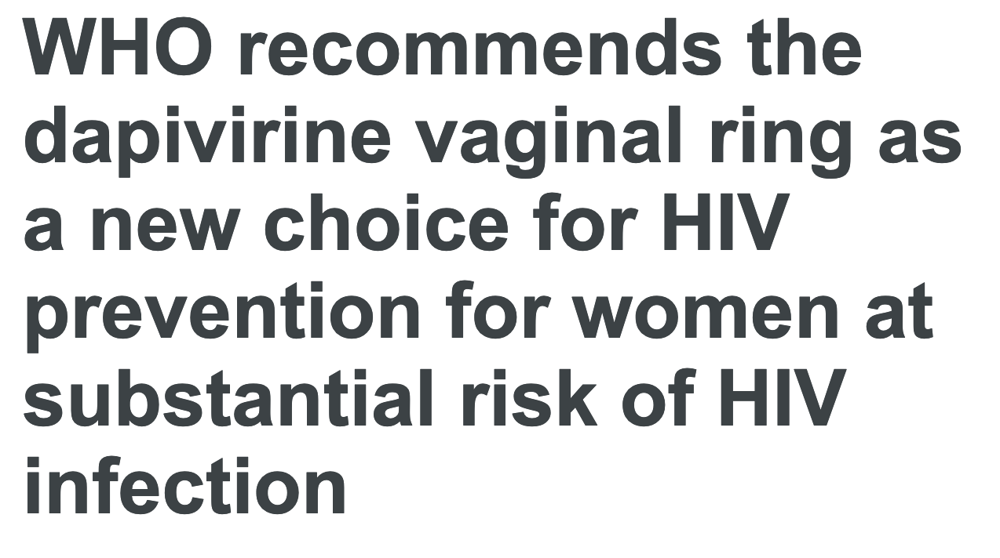
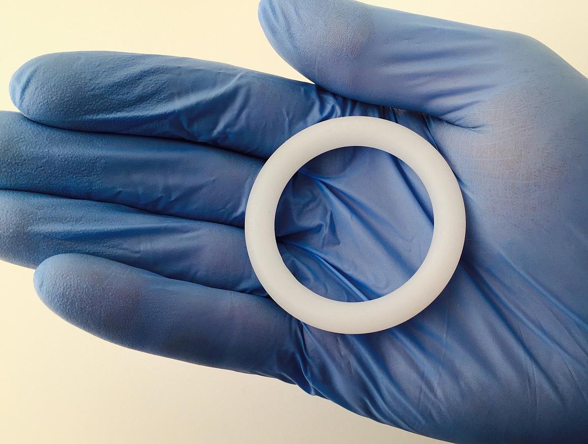
```

]

.pull-right[

```{r out.width="90%", echo=FALSE, fig.pos="center"}
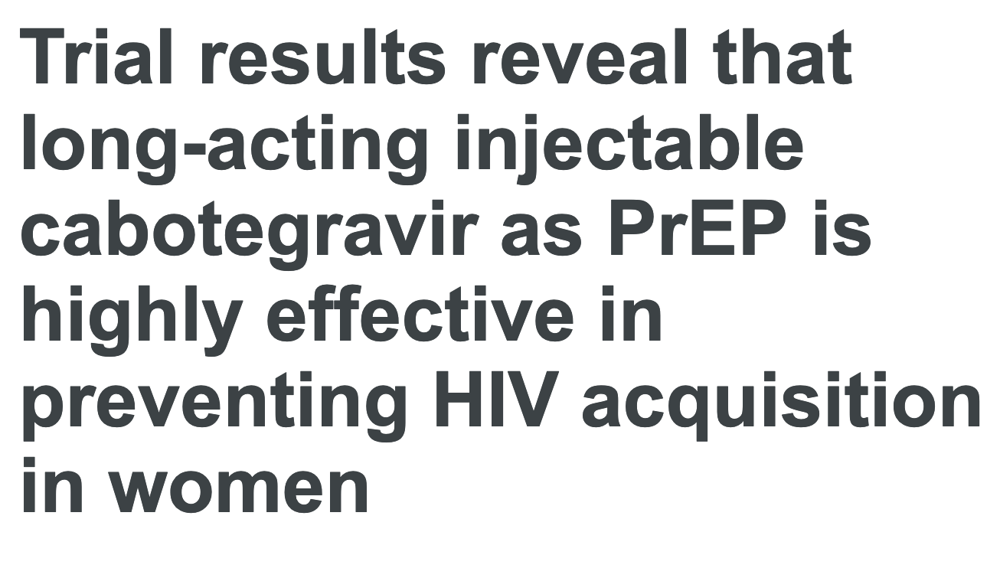

```

]

---

# Health disparities in the United States

```{r out.width="62%", echo=FALSE, fig.pos="center"}
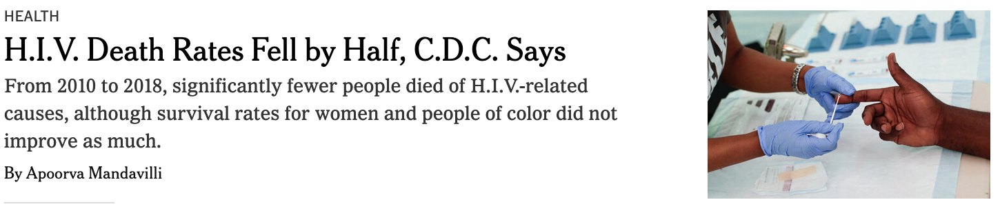
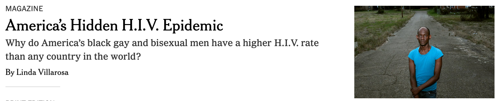
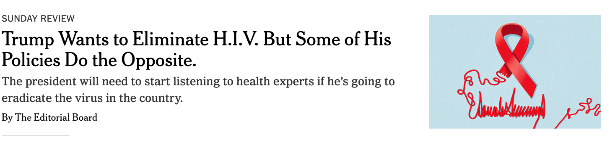
```


???

HIV has a disproportionate impact on certain populations, especially among racial and ethnic minorities and gay and bisexual men. 

This is built on historical social injustices.

Also underlying is unequal access to healthcare. 

Articles:
https://www.nytimes.com/2019/03/16/opinion/sunday/trump-pence-hiv.html
https://www.nytimes.com/2020/11/19/health/hiv-aids-death-rates-cdc.html

---

# Back to biostatistics

.pull-left[

```{r out.width="100%", echo=FALSE, fig.pos="center"}

```
]

.pull-right[
* How are these studies conducted?
* How do we know the extent of a disease?
* How do we detect new disease and understand progression?
* How do we study the effectiveness of drugs?
* What do we do with contradictory results?
]

Photo by <a href="https://unsplash.com/@thecreative_exchange?utm_source=unsplash&utm_medium=referral&utm_content=creditCopyText">The Creative Exchange</a> on <a href="/s/photos/reading-newspaper?utm_source=unsplash&utm_medium=referral&utm_content=creditCopyText">Unsplash</a>
  
---

# Biostaticians may specialize in:

`r emo::ji("gene")` **Genetics**: why are some people with a particular genetic mutation less susceptiple to HIV? 

`r emo::ji("microscope")` **Genomics**: how is the HIV virus evolving over time and place?

`r emo::ji("globe")` **Epidemiology**: what is the distribution of HIV? What are the causes of HIV acquisition? 

`r emo::ji("computer")` **Electronic health records**: how do we use EHRs and Medicaid/Medicare data to understand disparities in care?

Also: computational biology, neuroscience, clincial trial design, risk analysis, clinical decision making, environmental health, health policy. 

---

# Career Paths

.pull-left[
* **Academia** `r emo::ji("right_arrow")` universities, research institutes (staff and faculty)
* **Industry** `r emo::ji("right_arrow")` pharma, biotech, consulting, tech
* **Non-profit & Foundations** `r emo::ji("right_arrow")` global health, granting organizations
* **Health care** `r emo::ji("right_arrow")` Hospitals, insurance companies, community health centers
* **Government** `r emo::ji("right_arrow")` CDC, NIH FDA, U.S Digital Service, local health departments
* Many other routes that require data science skills.
]

.pull-right[

```{r echo=FALSE, out.width="80%"}

```

Photo by <a href="https://unsplash.com/@priscilladupreez?utm_source=unsplash&utm_medium=referral&utm_content=creditCopyText">Priscilla Du Preez</a> on <a href="/s/photos/working-at-computer-asian?utm_source=unsplash&utm_medium=referral&utm_content=creditCopyText">Unsplash</a>
  
]

---

# Working at SCHARP

```{r echo=FALSE, out.width="40%"}

```

* Analysis to inform regimen dose and scheduling for Phase I clinical trials for **HIV vaccines**.
* Collaborate with Johns Hopkins University and PATH to develop statistical methods for comparing candidate monoclonal antibodies for prevention of **malaria**.
* Develop **pharmacokinetic models** to understand the distribution and elimination of broadly neutralizing antibodies in development for the passive prevention and treatment of HIV. 
* Correlates analysis for non-human primate **schistosomiasis vaccine study**. 

Previously:
* Population mental health, pediatric obesity, community health program evaluation

---

.pull-left[

### What people think I do 

```{r echo=FALSE, out.width="90%"}
knitr::include_graphics("images/numbers.jpg")
```

Model building and statistical testing

Excel 

Stare at numbers

?

  
]


.pull.right[

### What I actually do

```{r echo=FALSE, out.width="40%"}
knitr::include_graphics("images/whiteboard.jpg")
```

Also data munging and EDA

R, SQL, git/GitHub

Software development 

A lot of writing 


]

???

Photo by <a href="https://unsplash.com/@kaleidico?utm_source=unsplash&utm_medium=referral&utm_content=creditCopyText">Kaleidico</a> on <a href="/s/photos/collaboration?utm_source=unsplash&utm_medium=referral&utm_content=creditCopyText">Unsplash</a>
  
Photo by <a href="https://unsplash.com/@mbaumi?utm_source=unsplash&utm_medium=referral&utm_content=creditCopyText">Mika Baumeister</a> on <a href="/s/photos/excel-sheets?utm_source=unsplash&utm_medium=referral&utm_content=creditCopyText">Unsplash</a>

---

.pull-left[

## Pros `r emo::ji("thumbs_up")`

* Flexibility
* Low stress
* Continuous learning
* Opportunities to grow
* Ability to jump around to different topics and applications

]

.pull-left[

## Cons `r emo::ji("thumbs_down")`

* Screen time
* Utilizes only certain kinds of creativity (maybe)
* Lots of prep work and communication (it's not doing statistics and coding all day)
* Some rigidity in qualifications 
]

---

# Grad School Options

#### The MPH 

A more applied degree

```{r echo=FALSE, out.width="60%"}

```

Photo by <a href="https://unsplash.com/@ssmith9?utm_source=unsplash&utm_medium=referral&utm_content=creditCopyText">Susan Smith</a> on <a href="/s/photos/field-work?utm_source=unsplash&utm_medium=referral&utm_content=creditCopyText">Unsplash</a>

---

# Grad School Options

#### The MS

A more technical degree

```{r echo=FALSE, out.width="60%"}
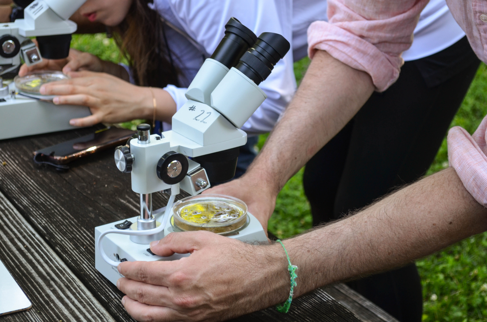
```

Photo by <a href="https://unsplash.com/@saralea?utm_source=unsplash&utm_medium=referral&utm_content=creditCopyText">Sara Cottle</a> on <a href="/s/photos/looking-through-microscope?utm_source=unsplash&utm_medium=referral&utm_content=creditCopyText">Unsplash</a>
  
  
---

# Grad School Options

#### The PhD

If you want to be more specialized or become an academic

```{r echo=FALSE, out.width="60%"}
knitr::include_graphics("images/lab-microscope.jpg")
```
  
Photo by <a href="https://unsplash.com/@thisisengineering?utm_source=unsplash&utm_medium=referral&utm_content=creditCopyText">ThisisEngineering RAEng</a> on <a href="/s/photos/math-microscope?utm_source=unsplash&utm_medium=referral&utm_content=creditCopyText">Unsplash</a>
  
---

# Grad School Options

.pull-left[
### Please read Donald Asher's book or go to one of his talks at Reed.
]

.pull-right[
```{r echo=FALSE, out.width="60%"}
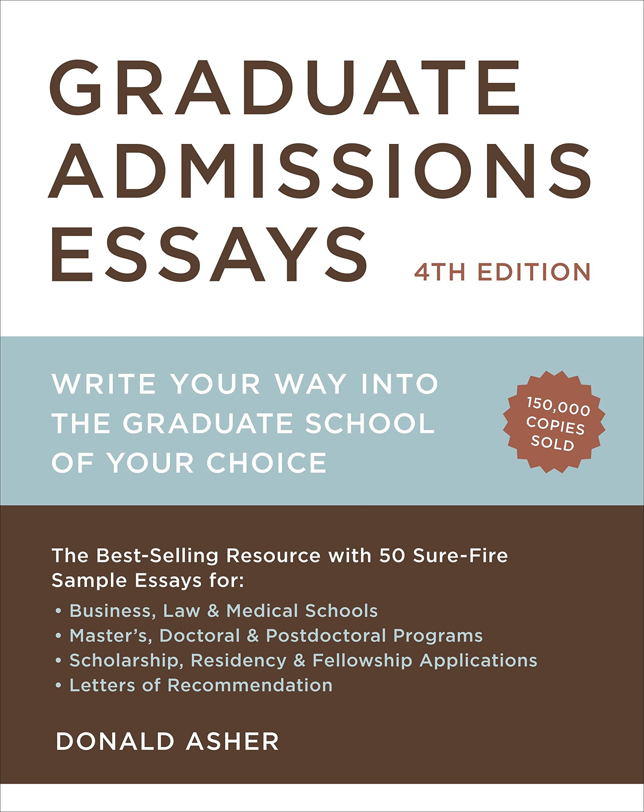
```
]

---

### Some ideas for gaining exposure to biostatistics (and public health) careers as an undergrad

`r emo::ji("one")` Do some field work: `r emo::ji("phone")` Talk to people in the Reed alumni directory

* Keep it short (15-20 min)
* Ask them who else to talk to
* Keep a spreadsheet with everyone you've talked to
* Periodically update them!

This was *very* hard for me at first and I promise you will get better at it. Get help from the career office. Tell them what you're scared about and ask them for advice. 

> The people that you will talk to have had different experiences and grown up in different environments. What worked for them may not work for you. 

---

### Some ideas for gaining exposure to biostatistics (and public health) careers as an undergrad

`r emo::ji("two")` Go to a conference or local meetup `r emo::ji("microphone")` `r emo::ji("woman_office_worker")` `r emo::ji("man_office_worker")`

* Lots of conferences have moved online this year
* Many have scholarships or are free

[R conferences](https://rviews.rstudio.com/2021/03/03/2021-r-conferences/): [Cascadia R Conf](https://cascadiarconf.com/), useR!, R/Medicine, R/Pharma

Data conferences: [csv,conf,v6](https://csvconf.com/)

Python conferences

Lots of stats conferences: JSM, find others through [American Statistical Association](https://www.amstat.org/asa/meetings/home.aspx) website. 

Meetup.com: Portland R User Group, R-Ladies, PyLadies PDX, Portland Python User Group

---

### Some ideas for gaining exposure to biostatistics (and public health) careers as an undergrad

`r emo::ji("three")` Read journals `r emo::ji("books")` 

.pull-left[

Get the table of contents of a journal (don't pick too many) delivered via email and read the abstract for whatever catches your eye. 

Some ideas: New England Journal of Medicine, JAMA, The Lancet, Biostatistics, American Journal of Epidemiology, American Statistician. 

]

.pull-right[
```{r echo=FALSE, out.width="80%"}
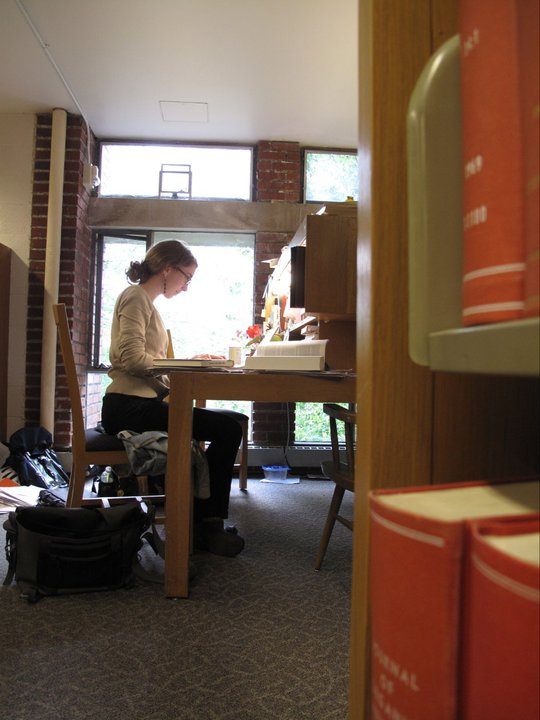
```
]


---

### Some ideas for gaining exposure to biostatistics (and public health) careers as an undergrad

`r emo::ji("four")` Internships, volunteer work, and summer programs `r emo::ji("woman_mechanic")`

* Ask the career office for help. 
* Use the network you've built by talking to Reed alumni.
* Summer programs: Universities offer more specialized summer programs (and scholarships), for example the [UW Summer Institutes](https://www.biostat.washington.edu/summerinstitutes). 

---

## Some advice

`r emo::ji("light_bulb")` Stacey Abrams on getting lost in possibilities: 

> I am a living example of the fact that there is no glory in having only one supreme goal. Too few books on achieving your dreams acknowledge that we are multifaceted beings with many different talents and interests. Society sometimes chides us to be focused on one goal, one passion, one ambition. It starts in college when we're told to pick a major.

On ambition: 

> Ambition means being proactive...[Do] something that moves you forward at a constant pace. 

Excerpt from *Lead from the Outside: How to Build Your Future and Make Real Change*

---

# Resources

* [Biostatistics: It's not what you think it is](https://simplystatistics.org/2015/11/09/biostatistics-its-not-what-you-think-it-is/). Simply Statistics post.
* [Not so Standard Deviations](https://nssdeviations.com/)
* [rOpenSci](https://ropensci.org/)
* [R-Ladies](https://rladies.org/) and [PyLadies](https://pyladies.com/)
* [Designing Your Life](https://designingyour.life/the-book/)
* Outdoors Leadership: Check out [Reed Outdoor Education Center](https://www.reed.edu/sports_center/rope/Outdoor%20Center.html), [Mazamas](https://mazamas.org/), [Mountaineers](https://www.mountaineers.org/)

---

# Public Health and Statistics Books

* [Pathologies of Power](https://bookshop.org/books/pathologies-of-power-health-human-rights-and-the-new-war-on-the-poor-9780520243262/9780520243262) by Paul Farmer
* [The Invisible Cure](https://bookshop.org/books/the-invisible-cure-why-we-are-losing-the-fight-against-aids-in-africa/9780312427726) by Helen Epstein
* [On Immunity: An Inoculation](https://bookshop.org/books/on-immunity-an-inoculation-9781555976897/9781555977207) by Eula Biss
* [Pox: An American History](https://www.goodreads.com/book/show/9730383-pox) by Michael Willrich
* [Epidemiology Matters: A New Introuduction to Methodological Foundations](https://oxfordmedicine.com/view/10.1093/med/9780199331246.001.0001/med-9780199331246) by Katherine M. Keyes and Sandro Galea 
* [Causal Inference: What If](https://www.hsph.harvard.edu/miguel-hernan/causal-inference-book/) by Miguel Hernán and Jamie Robins

---

class: center, middle

# Thanks!

Email: mwgerber@gmail.com

Twitter: @mwgerber

Slides created via the R package [**xaringan**](https://github.com/yihui/xaringan).
